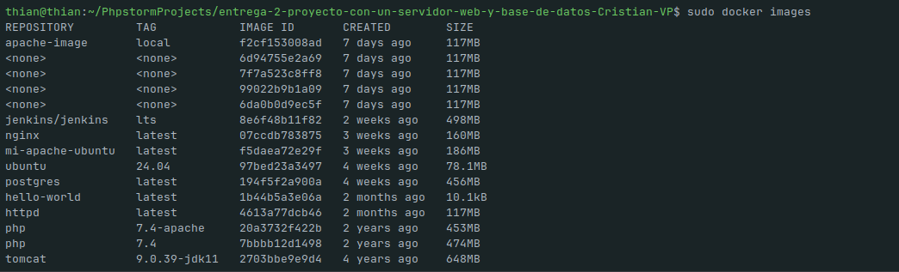
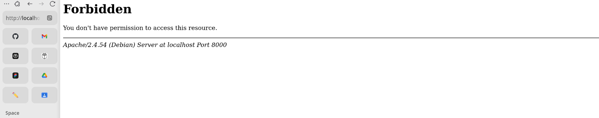
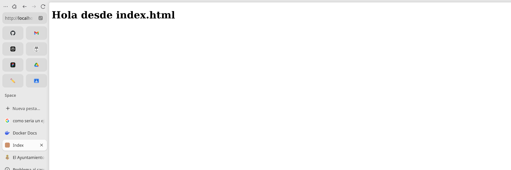
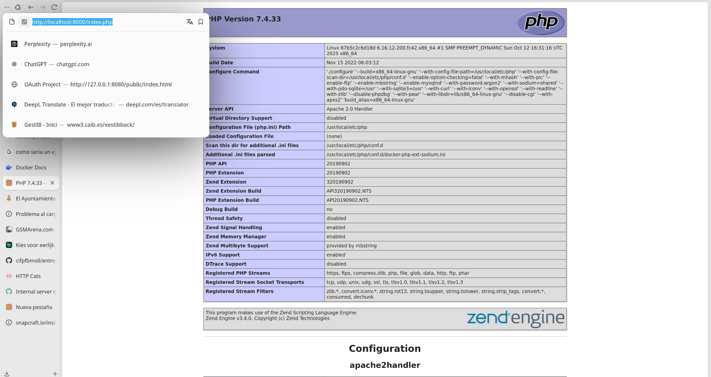
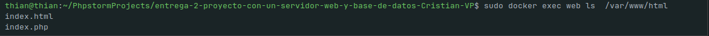
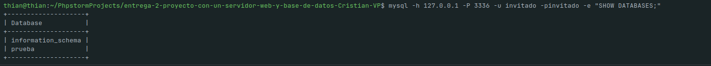
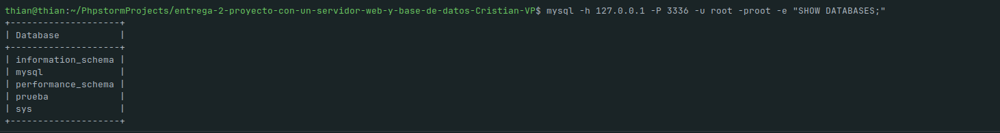
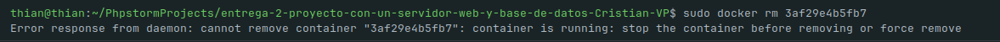

# Proyecto con un servidor web y un servidor de base de datos

## Introducción

Esta práctica documenta el despliegue de un servidor web basado en la imagen oficial de PHP con Apache y el arranque de un servidor de bases de datos MariaDB en contenedores Docker. El objetivo fue descargar las imágenes necesarias, crear los contenedores, comprobar el funcionamiento del servidor web y verificar el acceso remoto a la base de datos, aportando como evidencia capturas que ilustran cada comprobación relevante.

## Desarrollo

La primera fase consistió en descargar las imágenes indicadas y verificar su presencia local. La siguiente captura muestra la lista de imágenes disponibles tras las descargas realizadas:

Esta imagen sirve como evidencia de que las imágenes solicitadas (entre ellas `ubuntu:24.04`, `httpd`, `tomcat:9.0.39-jdk11`, `jenkins/jenkins:lts` y `php:7.4`) estaban presentes antes de crear los contenedores.

## Servidor web

Se desplegó un contenedor llamado `web` basado en `php:7.4-apache`, exponiendo el servicio en el puerto 8000 del host. A continuación se añadieron dos ficheros al directorio raíz del servidor web (`/var/www/html`): un `index.html` simple y un `index.php` que ejecuta `phpinfo()`.

La captura que muestra el arranque del contenedor web es la siguiente:

Al acceder desde el navegador, el `index.html` con el texto de presentación se mostró correctamente:

Y la página `index.php` produjo la salida de `phpinfo()`, confirmando que PHP está integrado con Apache en el contenedor:

También se comprobó el tamaño del contenedor después de copiar los ficheros al webroot; la evidencia de la operación (listado/copia y referencia al espacio ocupado) se recoge en:

## Servidor de base de datos

Para la parte de base de datos se empleó la imagen oficial de MariaDB, configurada con variables de entorno para crear la contraseña de root (`root`), la base de datos inicial llamada `prueba` y el usuario `invitado` con contraseña `invitado`. Tras arrancar el contenedor `bbdd` con el puerto 3336 mapeado al 3306 interno, se comprobó la conectividad desde el equipo anfitrión empleando un cliente MySQL.

Una vez configurado podemos acceder conectándonos con el usuario `invitado` o `root` y ejecutando `SHOW DATABASES;`, donde aparece la base de datos `prueba` creada en el arranque:

  
  

Se intentó eliminar la imagen `mariadb` mientras el contenedor `bbdd` permanecía creado. Tal y como se esperaba, Docker impidió la eliminación de la imagen y generó un error; la captura con el mensaje resultante se incluye como evidencia:

Describir las decisiones técnicas

- Se eligió `php:7.4-apache` para disponer de un servidor LAMP ligero sin necesidad de configurar Apache manualmente dentro del contenedor. Esto facilita servir páginas estáticas y ejecutar `phpinfo()` con rapidez.
- Para la verificación de la base de datos se prefirió conectar desde el host (no con `docker exec`) porque la práctica exige comprobar el acceso remoto mediante un cliente instalado en el equipo del alumno.
- Las capturas seleccionadas documentan solo los puntos exigidos por la práctica, manteniendo la memoria concisa y centrada en la evidencia.

